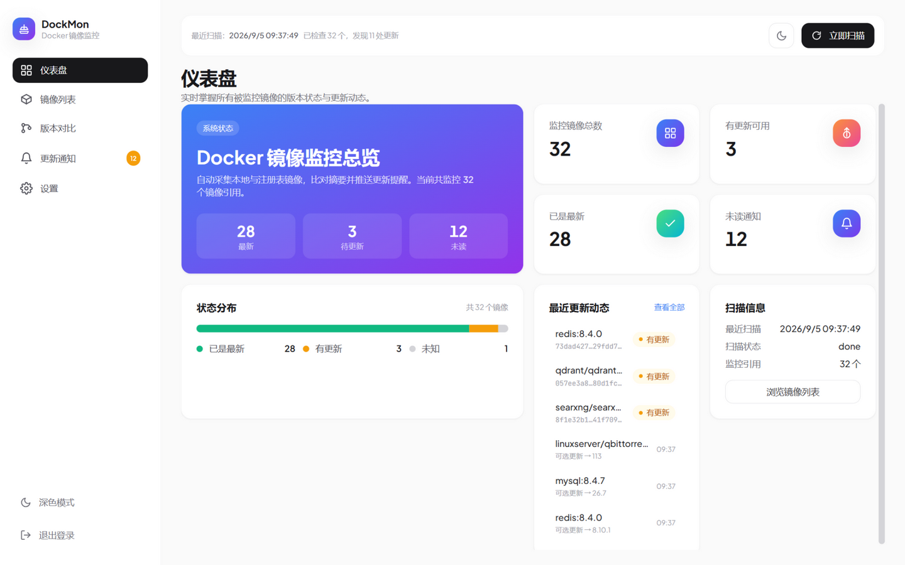
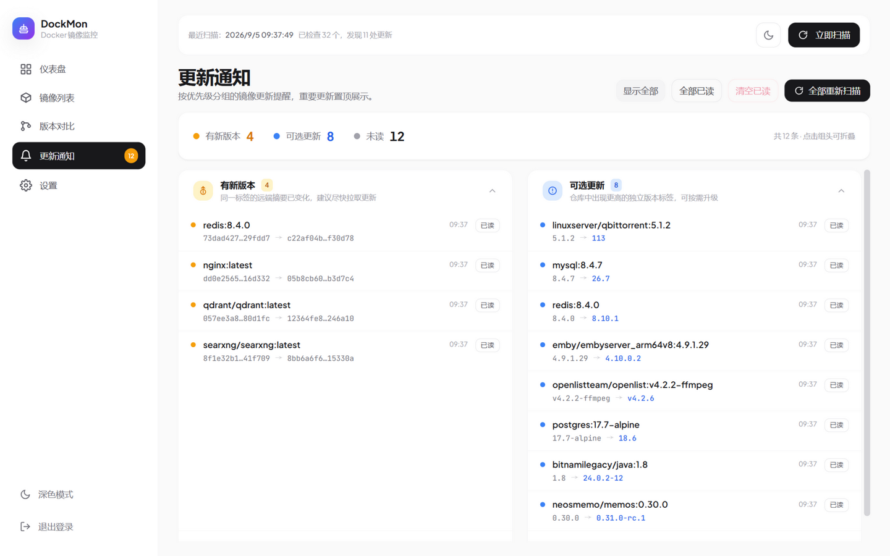
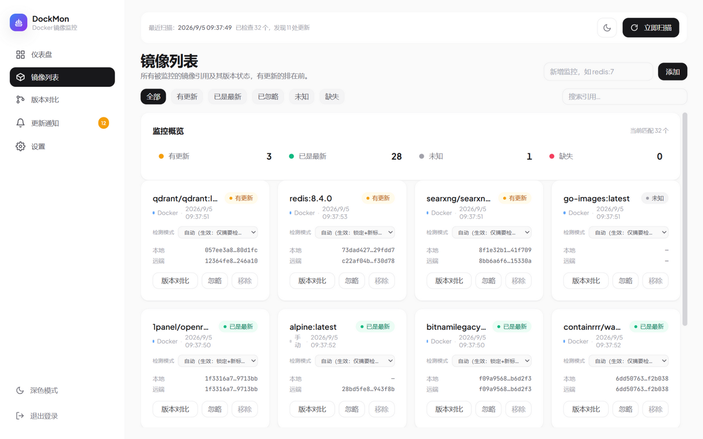
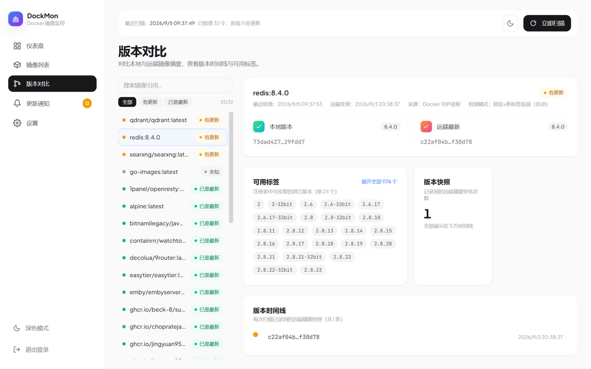
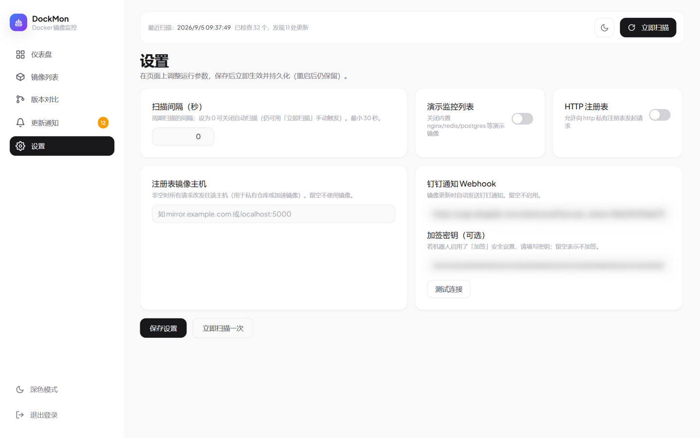
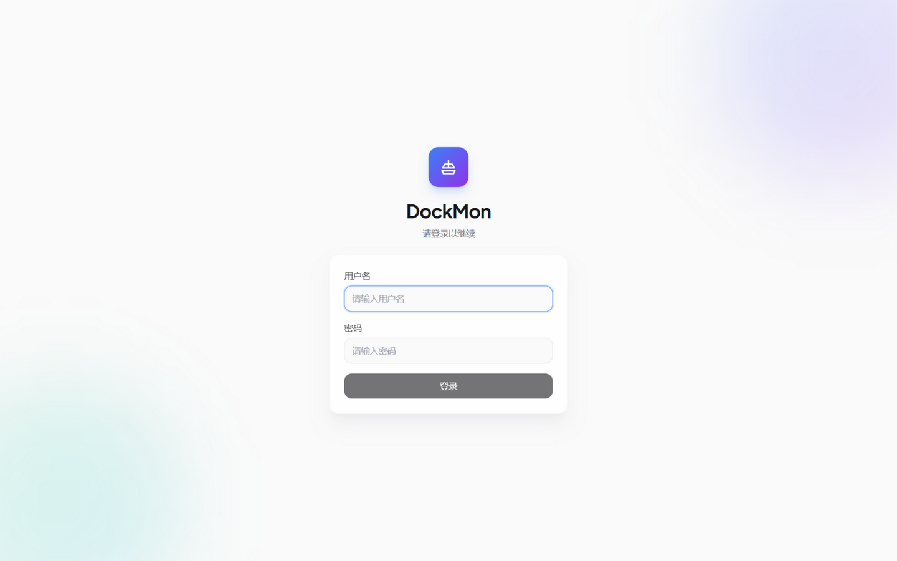

# DockMon · Docker 镜像监控

[](https://github.com/jingyuan9527/vigil/actions/workflows/build.yml)

一个参考 [diun](https://github.com/crazy-max/diun) 与 [wud (What's Up Docker)](https://github.com/fmartinou/whats-up-docker) 的 Docker 镜像更新监控工具：自动采集本机镜像（或手动添加监控项），比对注册表摘要与新版本标签，发现更新第一时间推送提醒（站内 + 钉钉）。

**特性一览**

- 🔍 **两种检测模式自动分配**：浮动标签（`latest` 等）追踪摘要变化；版本号标签（如 `8.4.5`）额外监视仓库的新版本 tag（如锁定 `8.4.5` 而仓库已有 `26`）
- 🔔 **两级通知**：「有新版本」（当前 tag 内容变更）与「可选更新」（出现更高的独立版本 tag），支持钉钉机器人推送
- 🖥️ **开箱即用的 Web UI**：单容器、单端口（54321）部署，仪表盘 / 镜像列表 / 版本对比 / 通知中心 / 在线设置
- 🔐 **账号认证**：JWT httpOnly Cookie + 登录限流；SQLite 持久化，数据不出本机
- 🧱 **多架构镜像**：GitHub Actions 自动构建 `linux/amd64` 与 `linux/arm64`，x86 服务器与树莓派均可直接拉取

## 界面预览

| 仪表盘 | 更新通知 |
|---|---|
|  |  |

| 镜像列表 | 版本对比 |
|---|---|
|  |  |

---

## 快速开始

> 唯一依赖是一个 Docker 环境（本机、NAS、树莓派均可），唯一端口 **54321**。

### 方式一：GHCR 预构建镜像（推荐）

镜像由 GitHub Actions 自动构建并发布到 GitHub Container Registry，已包含 `linux/amd64` 与 `linux/arm64` 双架构，无需本地编译，Docker 会自动匹配宿主架构。

`docker run` 一键启动：

```bash
docker run -d --name dockmon \
  -p 54321:54321 \
  -v /var/run/docker.sock:/var/run/docker.sock \
  -v dockmon-data:/data \
  --restart unless-stopped \
  ghcr.io/jingyuan9527/vigil:latest
```

或使用预置的 compose 文件（仅拉取镜像、不构建）：

```bash
docker compose -f docker-compose.ghcr.yml up -d
```

启动后访问 `http://localhost:54321`：

- 首次使用会引导**初始化管理员账号**；也可用 `ADMIN_USER` / `ADMIN_PASSWORD` 环境变量免交互创建。
- 挂载 `docker.sock` 后会自动监控本机所有带 tag 的镜像；未挂载（或无 Docker 守护进程）时也可通过 `WATCH` 变量或页面「添加监控」监视任意注册表镜像。
- 内置一组演示监控列表（nginx / redis / postgres 等），开箱即有数据；不需要可在设置页或用 `DISABLE_DEFAULT_WATCH=1` 关闭。

### 方式二：源码构建

```bash
git clone https://github.com/jingyuan9527/vigil.git
cd vigil
docker compose up -d --build
# 访问 http://localhost:54321
```

### 方式三：本地开发

```bash
# 后端（默认 54321 端口）
cd backend && go run ./cmd/server

# 前端（另开终端，Vite 将 /api 代理到 54321）
cd frontend && npm install && npm run dev
# 访问 http://localhost:5173
```

---

## 工作原理

```
┌──────────────────────────────────────────────────────────┐
│                       Docker 容器                          │
│                                                            │
│   React + Tailwind 静态资源  ──┐                           │
│                                │  54321 (单端口同源)        │
│   Go HTTP Server  ─────────────┤                           │
│     ├─ /api/*    REST 接口      │                           │
│     ├─ /*        前端 SPA        │                           │
│     ├─ scanner   采集+检测+通知   │                           │
│     ├─ registry  注册表摘要比对   │                           │
│     └─ store     SQLite 持久化   │                           │
└───────────────┬────────────────┘                           │
                │ 挂载 /var/run/docker.sock                  │
                ▼                                            │
        Docker 守护进程 / 注册表                               │
```

每个扫描周期（启动时立即执行一次）分三步：

1. **采集**：通过 Docker Engine API 读取本机全部带 tag 镜像及其摘要，合并 `WATCH` / 手动添加的纯远端监控项。
2. **检测**：向注册表（Docker Hub / GHCR / 私有 registry）查询当前 tag 的 manifest 摘要与本地比对；Pin-Watch 模式额外巡检仓库完整 tag 列表。
3. **通知**：当前 tag 摘要变化 → 「有新版本」；仓库出现更高的新版本 tag → 「可选更新」；站内通知 + 钉钉推送，并记录版本时间线。

---

## 检测模式与通知边界

每个镜像有两种检测模式，默认按 tag 自动识别（可在镜像列表手动覆写）：

### Digest-Only（仅校验当前标签摘要）
- 默认分配给浮动标签（`latest` / `nightly` / `dev` / `canary` / `beta`）及其它非版本号 tag。
- 只查当前 tag 的远端摘要是否变化 → 变化即发「有新版本」告警。
- **不拉取仓库全部 tag 列表，不通知别的新版本。**

### Pin-Watch（锁定版本 + 监视新标签）
- 默认分配给数字版本号 tag（如 `8.4.5`、`v3.9`、`1.2.3-alpine`）。
- 仍对比当前 tag 摘要（用于状态与版本时间线），但**锁定 tag 被仓库覆盖时不发告警**。
- 额外巡检仓库完整 tag 列表，出现从未见过的版本 tag → 每个 tag 发一条「可选更新」通知（每个 tag 仅一次）。
- 首巡会把当时已存在的全部 tag 记为已见基线（不通知）；这些「基线吞掉」的更高版本可由**强制扫描**按版本号比对找回。

### 通知类型与防抖
- `update`（强提醒）：当前标签内容变更；同一摘要常规扫描只通知一次，**强制扫描除外**（重新广播时再次通知）。
- `new-tag`（弱提醒）：仓库出现全新版本 tag（仅 Pin-Watch）；每个 tag 仅通知一次，首扫建立基线不刷屏，**强制扫描除外**。
- 未读通知永不自动删除；已读通知每次扫描后自动裁剪至最近 500 条，也可在通知页手动「清空已读」。
- 已读/清空仅影响界面展示，不影响去重基线。

### 强制扫描（「全部重新扫描」）
语义为**重新广播**：无视去重与已读，把所有镜像当成从未通知过来重新判定差异，每次触发都会再次通知（系统 + 钉钉），适合运维复盘或清空已读后找回提醒。
- 本地镜像：本地摘要 ≠ 远端摘要即重新广播。
- 纯远端监控：以版本时间线中最早记录的摘要为基线，仅当与当前远端不同才重新广播。
- Pin-Watch 镜像：按版本号比对仓库 tag 列表，存在比锁定 tag 更高的版本 → 重播最新的一个「可选更新」通知（含首巡基线吞掉的更高版本，如锁定 `8.4.5` 而仓库已有 `26`）；仓库无更高版本时不重播。
- 被忽略的镜像跳过全部检测，不产生任何通知。

---

## 核心页面

- **仪表盘**：监控总览（已是最新 / 有更新 / 未读）与状态分布、最近更新动态、扫描信息一览。
- **镜像列表**：有更新的排在前；「监控概览」统计卡即状态筛选入口（点击切换、再点取消，零计数自动隐藏），支持搜索与分页；每张卡片可切换检测模式、忽略/恢复、移除，或进入版本对比。
- **版本对比**：本地 vs 远端摘要（存在差异时高亮）、可用标签（按版本号新→旧排序，超长默认折叠）与版本时间线。
- **更新通知**：按「有新版本 / 可选更新」分组独立展示，支持未读过滤、单条/全部已读、清空已读与「全部重新扫描」（二次确认后会重新广播通知，含钉钉）。
- **设置**：在线调整扫描间隔、演示列表、http 注册表、注册表镜像与钉钉通知，保存后即时生效并持久化（重启保留）。

| 设置（钉钉等运行时参数） | 登录（首次访问初始化管理员） |
|---|---|
|  |  |

---

## 配置（环境变量）

| 变量 | 默认值 | 说明 |
|------|--------|------|
| `PORT` | `54321` | 对外服务端口 |
| `DB_PATH` | `/data/monitor.db` | SQLite 数据库路径 |
| `STATIC_DIR` | `./static` | 前端静态资源目录 |
| `DOCKER_HOST` | `unix:///var/run/docker.sock` | Docker 守护进程地址（`unix://` / `tcp://`） |
| `SCAN_INTERVAL` | `3600` | 周期扫描间隔（秒）；设为 `0` 关闭周期扫描（仍可手动触发），最小 30 |
| `REGISTRY_INSECURE` | `false` | 是否允许 `http` 注册表 |
| `REGISTRY_MIRROR` | 空 | 注册表镜像主机（非空时所有 manifest/tag 请求改发该主机，用于私有仓库/加速） |
| `WATCH` | 空 | 额外监控的镜像引用，逗号分隔（如 `nginx:latest,redis:7`） |
| `DISABLE_DEFAULT_WATCH` | `false` | 设为 `1` 关闭内置演示监控列表 |
| `ADMIN_USER` / `ADMIN_PASSWORD` | 空 | 首次部署自动创建管理员（两者需同时设置，密码至少 6 位） |
| `JWT_SECRET` | 空 | JWT 签名密钥；不设置则自动生成并持久化到数据库 |
| `DINGTALK_WEBHOOK` | 空 | 钉钉机器人 Webhook，配置后更新自动推送钉钉 |
| `DINGTALK_SECRET` | 空 | 钉钉机器人加签密钥（机器人开启「加签」安全设置时填写） |

> 扫描间隔、演示列表、http 注册表、注册表镜像、钉钉 Webhook / 加签密钥这六项**也可在页面「设置」中直接修改**，保存后即时生效并持久化到数据库，重启后仍然保留；环境变量仅作为首次启动的初值。

---

## REST API

| 方法 | 路径 | 说明 |
|------|------|------|
| GET | `/api/health` | 健康检查 |
| GET | `/api/auth/check` | 是否需要初始化设置 + 当前是否已认证 |
| POST | `/api/auth/setup` | 首次部署设置管理员账号（成功后写入登录 cookie） |
| POST | `/api/auth/login` | 登录（成功后写入登录 cookie） |
| POST | `/api/auth/logout` | 登出（清除登录 cookie） |
| GET | `/api/stats` | 仪表盘统计 |
| GET | `/api/images?status=` | 镜像列表（可按状态过滤） |
| POST | `/api/images` | 新增手动监控 `{ "reference": "nginx:latest" }` |
| GET | `/api/images/:id` | 镜像详情（含版本时间线、可用 tag） |
| DELETE | `/api/images/:id` | 移除监控 |
| PUT | `/api/images/:id/mode` | 设置检测模式覆写 `{ "mode": "auto" \| "digest-only" \| "pin-watch" }` |
| PUT | `/api/images/:id/ignored` | 忽略 / 恢复提醒 |
| POST | `/api/scan?force=1` | 立即扫描；`force=1` 为强制扫描（重新广播所有差异，每次触发都会再次通知） |
| GET | `/api/scans` | 扫描历史 |
| GET | `/api/notifications?unread=1` | 通知列表（支持 `cursor` 翻页） |
| POST | `/api/notifications/:id/read` | 标记单条已读 |
| POST | `/api/notifications/read-all` | 全部已读 |
| POST | `/api/notifications/clear-read` | 清空全部已读通知（未读不受影响） |
| GET / PUT | `/api/settings` | 读取 / 更新运行时设置（持久化并即时生效） |
| POST | `/api/dingtalk/test` | 测试钉钉 Webhook 连通性 |

> **认证与安全**：JWT 通过 `httpOnly` cookie（`SameSite=Lax`）下发，前端 JS 不接触令牌，降低 XSS 窃取风险；跨站请求不携带 cookie，天然抵御 CSRF。登录/初始化接口按 IP 限流：连续 5 次失败锁定 15 分钟。
>
> **扫描并发**：同一时刻只允许一次扫描执行（定时、手动、添加镜像并发触发时后到者跳过），重复触发 `/api/scan` 返回 `"result": "scan already running"`。

---

## 多架构镜像与版本

项目通过 GitHub Actions（[`.github/workflows/build.yml`](.github/workflows/build.yml)）自动构建 `linux/amd64` 与 `linux/arm64` 双架构镜像并推送至 GHCR（QEMU + Buildx 跨架构，复用 Actions 缓存；推送至 GHCR 无需额外配置，`GITHUB_TOKEN` 自动授权）：

| 触发 | 产出标签 | 用途 |
|------|----------|------|
| push `v1.2.3` 标签 | `1.2.3`、`1.2`、`1`、`latest` | 稳定版 / 锁定大版本 / 回滚 |
| push 到 `main` | `edge`、`sha-xxxx` | 开发版尝鲜 |
| Pull Request | 不推送，仅构建校验 | — |

版本号按 [RULES.md](RULES.md) 的语义化版本规则由提交内容自动推导（feat → 次版本，fix → 修订号，破坏性变更 → 主版本）。推荐生产环境锁定大版本，自动获取补丁：

```yaml
image: ghcr.io/jingyuan9527/vigil:1
```

---

## 目录结构

```
.
├── Dockerfile              # 多阶段构建（node 前端 + golang 后端）
├── docker-compose.yml      # 源码构建一键部署
├── docker-compose.ghcr.yml # GHCR 预构建镜像部署
├── backend/                # Go 后端
│   ├── cmd/server/main.go  # 入口：配置、扫描调度、HTTP 服务
│   └── internal/
│       ├── config/         # 环境变量与运行时设置
│       ├── docker/         # Docker Engine API 客户端
│       ├── registry/       # 注册表客户端（manifest 摘要 + 鉴权）
│       ├── store/          # SQLite 存储与 CRUD
│       ├── scanner/        # 扫描编排（采集→检测→通知）
│       ├── notification/   # 钉钉推送
│       ├── auth/           # 认证与限流
│       └── api/            # REST 路由 + 静态资源服务
└── frontend/               # React + Tailwind 前端
    └── src/pages/          # Dashboard / Images / Compare / Notifications / Settings
```
